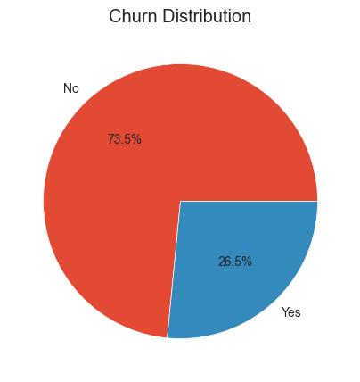
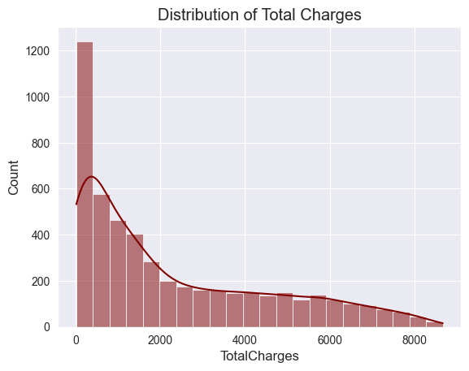
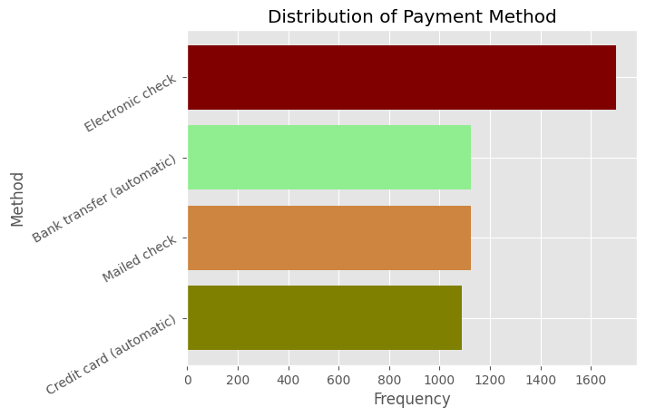
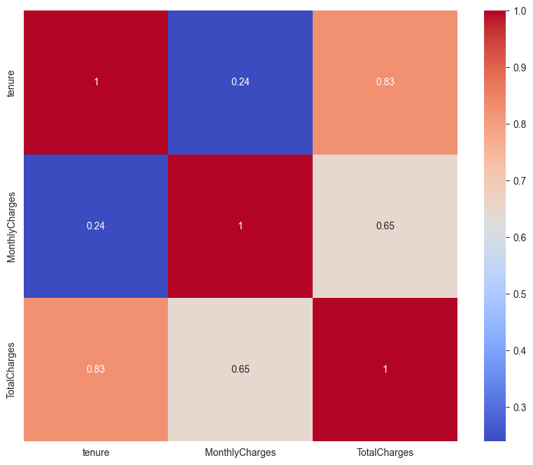
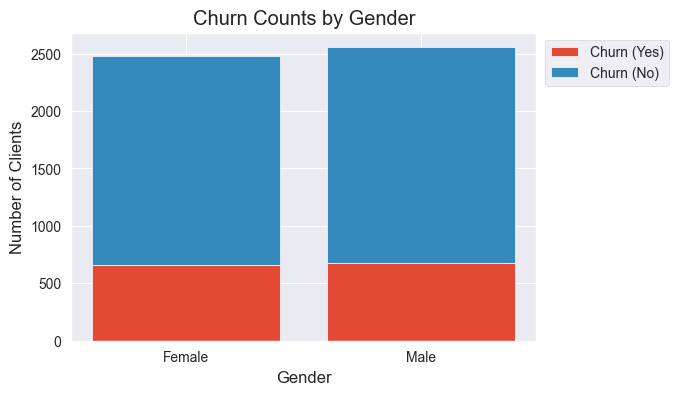
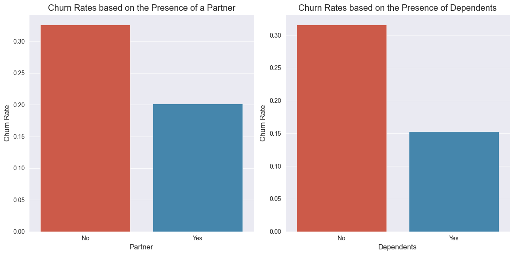
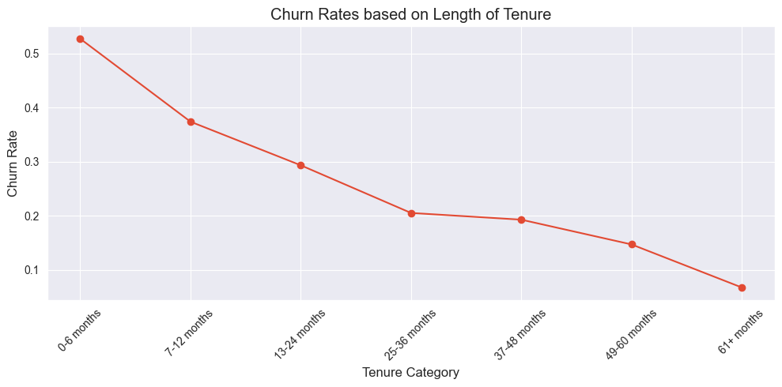
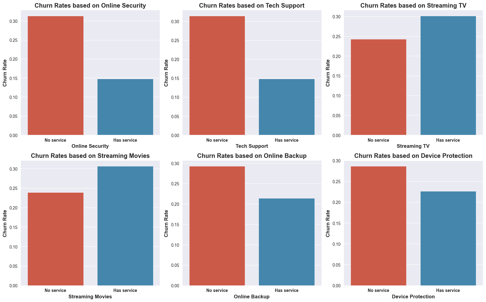
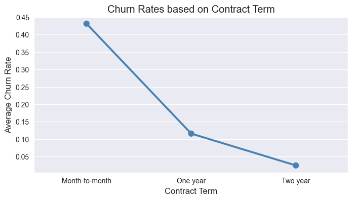

# Classification Project -- Predicting Customer Churn
## Telecommunication Company Churn Analysis
## Introduction

Customer attrition is one of the biggest expenditures of any
organization. Customer churn otherwise known as customer attrition or
customer turnover is the percentage of customers that stopped using your
company\'s product or service within a specified timeframe.\
Analysis and prediction of customer churn plays a crucial role in the success and growth of businesses, particularly those operating in subscription or service-oriented industries.
Churn analysis promotes data driven decision making. It enables businesses to effectively assess their performance, identify trends, and adapt strategies based on empirical evidence.
## Summary

| Code      | Name        | Published Article |  Deployed App |
|-----------|-------------|:-------------:|------:|
| LP2  | Medium | https://medium.com/@benjaminkipkem/predicting-churn-analysis-35f2e675a035 | [Best Article Machine learning](/) |
| LP2     | Power Bi        | https://app.powerbi.com/links/dsWSbDhr51?ctid=4487b52f-f118-4830-b49d-3c298cb71075&pbi_source=linkShare&bookmarkGuid=f8c9eb1b-65d2-4482-893e-90e63959bb4f |  Interactive Power Bi |

## Project Description
In this project, I aim to find the likelihood of a customer leaving the
organization, the key indicators of churn as well as the retention
strategies that can be implemented to avert this problem. I will build and train ML models and tune the hyperparameters of the top performing models to predict customer attrition with more accuracy.

## Data Understanding

The data for this project is in a csv format. The following describes
the columns present in the data.

**Gender** -- Whether the customer is a male or a female

**SeniorCitizen** -- Whether a customer is a senior citizen or not

**Partner** -- Whether the customer has a partner or not (Yes, No)

**Dependents** -- Whether the customer has dependents or not (Yes, No)

**Tenure** -- Number of months the customer has stayed with the company

**Phone Service** -- Whether the customer has a phone service or not
(Yes, No)

**MultipleLines** -- Whether the customer has multiple lines or not

**InternetService** -- Customer's internet service provider (DSL, Fiber
Optic, No)

**OnlineSecurity** -- Whether the customer has online security or not
(Yes, No, No Internet)

**OnlineBackup** -- Whether the customer has online backup or not (Yes,
No, No Internet)

**DeviceProtection** -- Whether the customer has device protection or
not (Yes, No, No internet service)

**TechSupport** -- Whether the customer has tech support or not (Yes,
No, No internet)

**StreamingTV** -- Whether the customer has streaming TV or not (Yes,
No, No internet service)

**StreamingMovies** -- Whether the customer has streaming movies or not
(Yes, No, No Internet service)

**Contract** -- The contract term of the customer (Month-to-Month, One
year, Two year)

**PaperlessBilling** -- Whether the customer has paperless billing or
not (Yes, No)

**Payment Method** -- The customer's payment method (Electronic check,
mailed check, Bank transfer(automatic), Credit card(automatic))

**MonthlyCharges** -- The amount charged to the customer monthly

**TotalCharges** -- The total amount charged to the customer

**Churn** -- Whether the customer churned or not (Yes or No)

## Data Processing
- **Importation of libraries:** I imported all the relevant libraries and modules necessary for the machine learning project.
- **Cleaning of Data:** I cleaned my train and test data sets systemically based on domain knowledge. I filtered out a few outliers and Imputed missing values in the train set. I found some different data types in the columns and harmonized them in both the train and testset.
- **Creation of a Preprocessor:** This enabled encoding of categorical variables, Standardization and Scaling. It played a pivotal role in prepairing data for machine learning.

## Data evaluation
- Carried out vizualizations to deepen data understanding.

 **Univariate Analysis**

**Bivariate Analysis**

**Multivariate Analysis**

## Hypothesis test

✨ **NULL:** Contract type does not influence customer churn

✨ **ALTERNATE:** Contract type affects customer churn

- based on chi-square test, we observe that the p-value is less than alpha, hence we reject Ho and conclude that is there is a statistical significance association between Churn and Contract.

## Business Questions

1. Does gender impact customer churn? Are there significant differences in churn rates between male and female customers?

2. Does the presence of a partner or dependents influence customer churn? Is there a relationship betweeen marital status and churn behavior?

3.How does the length of tenure affect churn rates? Are customers with longer tenures less likely to churn compared to new customes?

4. What role do additional services(e.g., online security, tech support, streaming TV, etc.) play in reducing customer churn? Are customers with more services less likey to churn?

5. Is there a correlation between the contract term (month-to-month, one year, two years) and churn rates? Are customers on long-term contracts less likely to churn compared to those on month-to-month contracts?

## Setup
1. **Clone the repository:**

   git clone https://github.com/kaitany/Telecommunications-Churn-Analysis.git

2. Navigate to the project directory:
    cd Telecommunications-Churn-Analysis

3. Install required dependencies:
    pip install -r requirements.txt

4. Download the dataset:
    Download the Telco Churn datasets from the datasets folder and place it in the data directory. 

5. Run the analysis:
    Depending on your preferred IDE or notebook environment, open and run the provided Jupyter Notebook or Python scripts. 

6. Evaluate models:
    After training and tuning models, evaluate them using the evaluation dataset. You can use the provided evaluation script or notebook.

7. Export the best model:
    If desired, export the best trained model using the provided export script.

## App Execution
To use the exported best model for predictions:
1. Load the exported model:
In your Python script or notebook, load the saved model using pickle:
import pickle

with open('export/customer_churn_model.pkl', 'rb') as f:
    best_model = pickle.load(f)

2. Make predictions:
Use the loaded model to make predictions on new data:
new_data = ...  # Prepare your new data
predictions = best_model.predict(new_data)

## Conclusions 

Gradient Boost Classifier emerged as the best model for overall performance in predicting customer churn. This model outperforms the rest in terms of accuracy, precision, recall and F1 score.

## Key Insights :chart_with_upwards_trend:

✨ Customer churn rate decreases with an increase in tenure :chart_with_upwards_trend:

✨ Availability of additional services plays a crucial role in reducing customer churn :chart_with_upwards_trend:

✨ customers on long-term contracts are less likely to churn compared to those on month-to-month contracts :chart_with_upwards_trend:

## Appreciation
-   I highly recommend Azubi Africa for their comprehensive and effective programs. Read More articles about https://medium.com/@azubiafrica and take a few minutes to visit this link to learn more about Azubi Africa life-changing https://bit.ly/41CGCwK

-  **Tags**

https://bit.ly/3ARq742

## Author
`Benjamin Kaitany`

`Data Analyst`

`Azubi Africa` 

